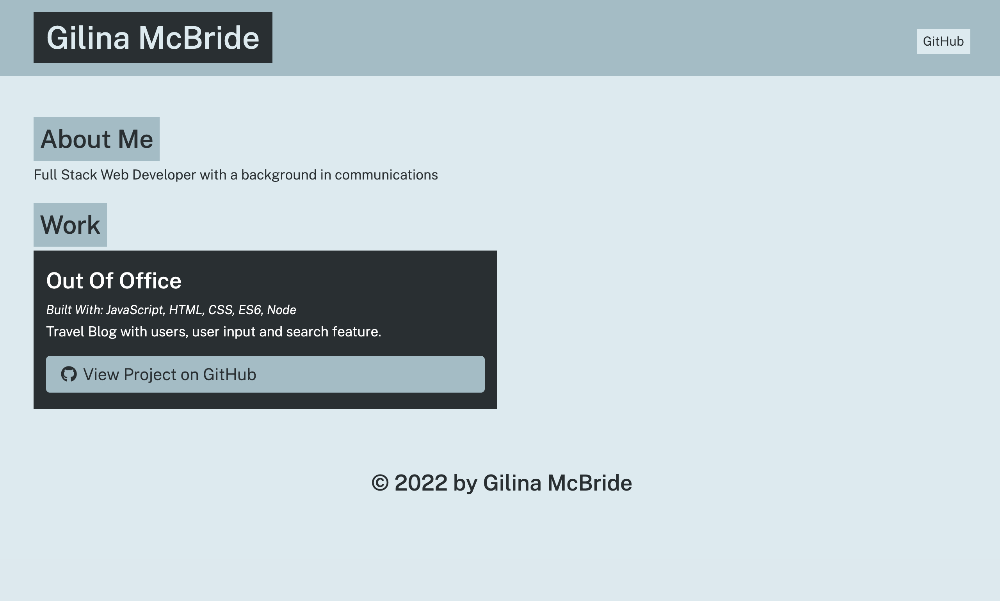

# Portfolio Generator

## Table of Contents

- [Description](#description)
- [Usage](#usage)
- [Questions](#questions)

## Description

Portfolio Generator uses Node.js and Inquirer to build a program that creates an HTML portfolio page. This app was created by following the steps of a course module. Example of portfolio generated in dist library.

## Usage

Clone respository and install necessary npm packages. Run "node app.js" and follow the prompts and answer the questions. The generated html file will be located in the dist folder.

## Application

## Questions?

For any questions, please email gilinamcbride@gmail.com, or visit any other projects on [Github](github.com/gilinamcbride).
